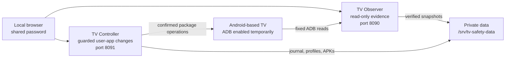

# TV Safety

TV Safety is a self-hosted Smart TV inventory and maintenance suite for a Raspberry Pi. It gives
you a local web interface for understanding what is installed on an Android-based television,
capturing checksum-protected evidence, managing user APKs, and reversing individual maintenance
actions without granting the application unrestricted shell access.

The suite is intentionally split into two services with one shared interface and password:

- **TV Observer** is the read-only side. It inventories the TV, classifies user and system
  packages, records firmware identity, and exports reports.
- **TV Controller** is the guarded maintenance side. It manages third-party APKs, records every TV
  mutation, supports selective rollback, and can capture and reapply exact user-application
  profiles.

Both services run locally on your Raspberry Pi. There is no cloud account, telemetry service,
analytics SDK, or built-in AI upload.

> [!IMPORTANT]
> TV Safety is not a firmware flasher, root tool, warranty guarantee, or substitute for a vendor
> recovery image. Observer snapshots describe device state; they are not full TV backups.

## Why TV Safety

Smart TVs often contain hundreds of packages with little explanation of what is user-installed,
system-owned, enabled, disabled, or safe to change. TV Safety turns that opaque state into a
reviewable workflow:

1. Connect over ADB from a private LAN.
2. Capture a read-only, checksum-verified inventory.
3. Review package names, versions, install levels, states, and requested permissions.
4. Download or add APKs to private Controller storage.
5. Apply only explicit user-package operations.
6. Record exact before/after state for every mutation.
7. Revert one operation without undoing unrelated later work.
8. Save a named profile after the TV reaches a stable state.

## Main Features

### Observer

- Fixed, read-only ADB command allowlist; no generic command endpoint.
- Multi-signal detection for Android TV, Google TV, and Fire OS.
- Inventory of user, system, updated-system, disabled, and unknown packages.
- Package versions, enabled state, code location, and requested permissions.
- Firmware build, security patch, model, serial, launcher, memory, storage, process, and network
  evidence.
- Atomic snapshots with SHA-256 verification.
- Human-readable and JSON application exports.
- Snapshot diff, archive, and identifier redaction tools.
- Manual recovery-readiness records that never pretend to be firmware backups.

### Controller

- Private APK library and background download tasks.
- Read-only update checks.
- Confirmed installation, update, uninstall, enable, and disable actions for third-party packages.
- Hard refusal for system packages and built-in never-touch package families.
- Durable SQLite operation journal with exact device and package state.
- Selective rollback that leaves later operations on other packages active.
- Explicit handling for uncertain ADB outcomes.
- Named state profiles containing exact APK versions and enabled states.
- Exact model, firmware, and build-fingerprint gates before profile application.
- Sequential profile application that stops on the first mismatch.
- APK retention while a file is required by rollback history or a saved profile.

## Architecture



The services share only the UI package, credentials, and private evidence boundary. Observer owns
canonical inventory. Controller reads verified Observer snapshots instead of creating a second,
conflicting inventory.

## Compatibility

There is no honest universal model whitelist. TV manufacturers reuse model names across regions and
ship different operating systems or firmware on visually identical hardware. Compatibility depends
on the installed platform and the ADB capabilities exposed by that exact build.

| Platform or device family | Status | Requirements |
| --- | --- | --- |
| Android TV | Supported when ADB is available | `adb shell`, `pm`, `dumpsys`, and `getprop` must work |
| Google TV | Supported when ADB is available | Same requirements; network debugging varies by vendor and Android version |
| Amazon Fire TV / Fire OS | Supported when ADB debugging is available | Android-based Fire OS with network ADB; exact behavior still depends on firmware |
| TCL, Sony, Philips, Hisense, Xiaomi, Nvidia, and other Android/Google TV products | Potentially compatible | The specific regional model must expose usable ADB; brand alone is not proof |
| Amazon Vega OS | Not supported by the current transport | Vega uses VDA/Vega developer tooling rather than this suite's ADB adapter |
| Samsung Tizen, LG webOS, Roku OS, VIDAA, Apple TV | Not supported | These platforms do not expose the Android package and ADB interfaces used here |

The included `TCL 65T6C` Controller profile is an **unverified template**, not a certification that
every TCL 65T6C variant is compatible or safe to modify. A profile becomes usable only after it is
replaced with evidence from the exact TV and firmware and passes all built-in gates.

### Quick compatibility test

Your TV is a candidate when all of these statements are true:

- Its operating system is Android TV, Google TV, or Android-based Fire OS.
- Developer options expose USB debugging, ADB debugging, or wireless/network debugging.
- The Raspberry Pi can reach the TV's ADB port on the private LAN.
- `adb devices -l` reports the TV as `device`, not `offline` or `unauthorized`.
- `adb shell getprop`, `adb shell pm list packages`, and `adb shell dumpsys package` work.

Start with Observer. Do not enable Controller mutations until the read-only inventory succeeds and
you have reviewed the device identity.

## Requirements

### Raspberry Pi

- Raspberry Pi 3, 4, or 5, or another Debian-compatible host.
- 64-bit Raspberry Pi OS, DietPi, or Debian with `apt-get` and systemd.
- Python 3.11 or newer.
- Local storage for snapshots and APK archives. Exact capacity depends on how many APK versions you
  retain.
- Ethernet or reliable Wi-Fi on the same private network as the TV.
- A stable Raspberry Pi address, preferably assigned through a DHCP reservation.

The root deployer installs missing OS packages including Python venv support, ADB, `rsync`, and CA
certificates.

### Television

- A compatible Android-based TV platform.
- Developer/ADB access enabled by the owner.
- Network ADB or a previously established ADB connection visible to the Raspberry Pi service user.
- Physical access to the screen and remote for the first RSA authorization prompt.

## Install on Raspberry Pi

Upload the **entire repository directory** to the Raspberry Pi, for example to
`/home/pi/TV-Cleaner` or `/root/TV-Cleaner`. Do not upload only one service directory.

```bash
cd /path/to/TV-Cleaner
bash ./tv.sh --check
sudo bash ./tv.sh
```

On first installation, the deployer asks for one shared web password. The minimum length is six
characters. Leave the interactive prompt empty to generate a password. For a non-interactive first
installation:

```bash
sudo TV_OBSERVER_ADMIN_PASSWORD='choose-a-local-password' bash ./tv.sh
```

The installer:

- validates the uploaded bundle and shell syntax;
- installs only missing operating-system dependencies;
- creates the restricted `tv-safety` service account;
- installs or updates Observer, Controller, and their shared UI;
- binds the web services to the LAN while restricting clients to loopback and RFC 1918 networks;
- creates and preserves private data under `/srv/tv-safety-data`;
- removes retired application files and generated upload artifacts;
- restarts and verifies both systemd services.

Open:

- Observer: `http://<raspberry-pi-ip>:8090`
- Controller: `http://<raspberry-pi-ip>:8091`

Both interfaces use the same password. Use the Observer Settings page or this command to change it:

```bash
sudo bash ./tv.sh --reset-password
```

### Updates

For every future update, upload the complete repository again and run the same command:

```bash
sudo bash ./tv.sh
```

The update replaces application code but preserves credentials, snapshots, operation history,
named profiles, APK archives, logs, and backups. Ephemeral completed Activity tasks are discarded.

## Enable ADB on the TV

Menu names vary by manufacturer and firmware. Use the TV vendor's documentation when it conflicts
with the generic paths below.

### Android TV and Google TV

The standard Android TV flow is:

1. Open **Settings**.
2. Open **Device Preferences** or **System**, then **About**.
3. Select **Build** or **Android TV OS build** repeatedly until the TV reports that developer mode
   is enabled.
4. Return to Settings and open **Developer options**.
5. Enable **USB debugging**, **ADB debugging**, or **Wireless debugging**, depending on the device.
6. Note the TV IP address from its network or About/Status screen.

Modern Android wireless debugging may require a pairing code and may show separate pairing and
connection ports. Older TV firmware commonly exposes legacy network ADB on port `5555`. TV Safety
accepts any valid private IP and port in Controller Settings, but pairing itself must be completed
before the service can connect.

### Amazon Fire TV / Fire OS

The standard Fire TV flow is:

1. Open **Settings > My Fire TV** or **Device & Software**.
2. Open **Developer Options** and enable **ADB Debugging**.
3. If Developer Options is hidden, open **About**, highlight the device name, and press the remote
   select button seven times.
4. Find the IP address under **About > Network**.
5. Connect to `<tv-ip>:5555` and approve the authorization prompt on the television.

Amazon's official guide is available at
[Connect to Fire TV Through ADB](https://developer.amazon.com/docs/fire-tv/connecting-adb-to-device.html).

### Pair or connect as the service user

ADB authorization keys must belong to the same `tv-safety` account that runs both services. For a
legacy network ADB endpoint:

```bash
sudo -u tv-safety env \
  HOME=/srv/tv-safety-data/controller \
  ANDROID_USER_HOME=/srv/tv-safety-data/controller \
  adb connect <tv-ip>:5555

sudo -u tv-safety env \
  HOME=/srv/tv-safety-data/controller \
  ANDROID_USER_HOME=/srv/tv-safety-data/controller \
  adb devices -l
```

For Android wireless debugging with a pairing code, use the pairing address shown by the TV:

```bash
sudo -u tv-safety env \
  HOME=/srv/tv-safety-data/controller \
  ANDROID_USER_HOME=/srv/tv-safety-data/controller \
  adb pair <tv-ip>:<pairing-port>

sudo -u tv-safety env \
  HOME=/srv/tv-safety-data/controller \
  ANDROID_USER_HOME=/srv/tv-safety-data/controller \
  adb connect <tv-ip>:<connection-port>
```

Enter the resulting connection address in **Controller > Settings > TV ADB address**. Android's
official references are [Create and run a TV app](https://developer.android.com/training/tv/get-started/create)
and [Android Debug Bridge](https://developer.android.com/tools/adb).

> [!TIP]
> After the initial authorization, reserve the TV's IP address in your router. A changed TV address
> is the most common reason a previously working local connection stops working.

## First-Run Workflow

1. Install TV Safety and sign in to Observer on port `8090`.
2. Enable and authorize ADB on the TV.
3. Open **Observer > Connect**.
4. Verify that the expected serial and model are shown as connected.
5. Create a snapshot with a simple local label such as `living-room-tv`.
6. Review **Applications**, **Snapshots**, **Reports**, and **Recovery**.
7. Export the application inventory if you want to analyze it outside the suite.
8. Open Controller on port `8091`.
9. Configure the TV ADB address under **Controller > Settings**.
10. Keep TV changes locked until the inventory and TV identity look correct.

Empty pages are normal before an authorized snapshot exists. The suite does not invent device facts
when the TV is disconnected.

## APK Manager

Controller stores APKs in:

```text
/srv/tv-safety-data/controller/apks
```

You can download through the configured endpoint or place an APK directly in that directory. A
manually added file should use `<package-name>-<version-code>.apk`, for example
`org.example.player-42.apk`, so Controller can identify it without downloader metadata. Keep files
private and do not expose the directory through DLNA, SMB guest shares, or a public web server.

Downloaded APKs are not automatically trusted. Controller validates file shape, size, paths,
metadata, and embedded signature material where available, but a third-party downloader is not a
publisher identity authority. Use APKs from the original developer or a source you independently
trust whenever possible.

TV changes remain disabled until **Allow confirmed TV changes** is enabled in Controller Settings.
Every mutation still requires a separate confirmation and a successful TV preflight.

## Journal and Selective Rollback

Controller records every user-package mutation before sending it to ADB. A journal entry includes:

- exact device model, firmware, platform signal, and build fingerprint;
- package state before and after the operation;
- action and inverse action;
- retained APK references needed for restoration;
- profile batch and parent-operation relationships;
- completion, uncertainty, reconciliation, or rollback status.

You can revert an older operation while leaving later operations on **other packages** untouched.
Controller refuses rollback when a newer active operation changed the same package, because two
incompatible states of one package cannot both remain active. It also refuses when the live package
state or device identity has drifted from the recorded branch.

An `uncertain` status means ADB may have changed the TV but Controller could not verify the result.
When you request recovery, Controller first reads live state. If the TV already matches the recorded
before-state, it reconciles the record without sending another mutation.

## Named State Profiles

Use **Controller > Plans** after the TV has been stable for a suitable period. A profile captures:

- exact TV model, firmware, and build fingerprint;
- all visible third-party packages;
- exact version codes and names;
- enabled or disabled state;
- exact local APK references.

A profile is restore-ready only when every required APK version is archived. Application is blocked
on another model, firmware, or fingerprint, runs sequentially, and stops on the first mismatch. It
does not remove extra applications and never modifies system or never-touch packages.

After a factory reset, complete normal TV setup, enable ADB again, authorize the Raspberry Pi, open
the profile preview, and apply the profile only if every compatibility gate passes.

## Safety Model

- Observer exposes only fixed read operations.
- ADB commands use argument arrays without a shell.
- Controller accepts only private-network IP addresses.
- Mutations require sideload mode, explicit confirmation, live ADB preflight, and package checks.
- System packages and critical package-name families are blocked.
- No automatic mutation retries are performed.
- Profile application stops rather than guessing.
- Every mutation is journaled before execution.
- Required rollback APKs cannot be deleted.
- Web POST requests require CSRF tokens.
- Login attempts are rate-limited.
- Services run as an unprivileged system account with a restricted systemd sandbox.

These controls reduce risk; they cannot make arbitrary sideloaded software safe or guarantee that a
vendor will honor a warranty. Review your TV's terms and recovery process before enabling developer
features or changing applications.

## Privacy and Data Locations

Runtime data stays on the Raspberry Pi:

```text
/srv/tv-observer                         Observer application
/srv/tv-controller                       Controller application
/srv/tv-shared                           Shared local UI
/srv/tv-safety-data/observer              Credentials and snapshots
/srv/tv-safety-data/controller            APKs, ADB keys, journal, profiles, settings
/srv/tv-safety-data/backups               Private backups
/srv/tv-safety-data/logs                  Deployment logs
```

Snapshot collection excludes passwords, authentication tokens, cookies, Wi-Fi credentials, and
message contents by design. Reports can still contain device identifiers, package names, network
addresses, or account-related metadata reported by Android. Review exports before sharing them.

## Troubleshooting

### The web page does not open

```bash
sudo systemctl status tv-observer.service tv-controller.service
sudo ss -lntp | grep -E ':8090|:8091'
```

Use the Raspberry Pi LAN address, not `127.0.0.1`, from another device. Confirm that both devices are
on the same private network. If UFW is active, `tv.sh` adds private-network rules for ports 8090 and
8091.

### The TV is not listed

```bash
sudo -u tv-safety env \
  HOME=/srv/tv-safety-data/controller \
  ANDROID_USER_HOME=/srv/tv-safety-data/controller \
  adb devices -l
```

- `unauthorized`: accept the RSA prompt on the TV.
- `offline`: disable and re-enable debugging, then reconnect.
- no device: verify IP, port, TV power state, and network isolation.
- connection refused: the TV is not listening on that port or debugging is disabled.

### Controller reports an ADB service error

Redeploy to restore the service-owned ADB home and permissions:

```bash
sudo bash ./tv.sh
```

The ADB home must remain `/srv/tv-safety-data/controller`, writable only by `tv-safety`.

### A rollback is unavailable

Read the Journal status. Rollback is intentionally blocked after same-package drift, device build
changes, a newer unresolved same-package operation, or loss of the exact required APK.

### A profile is not ready

Open its preview. Typical blockers are a missing exact APK, firmware/fingerprint mismatch, or a
current installed version that cannot itself be restored.

## Backup and Removal

Back up `/srv/tv-safety-data` to encrypted, owner-controlled storage. Do not place it in a public
media directory.

Each component includes an uninstall script. Read it before use. Removal of application services is
separate from deletion of private data and backups; the deployment workflow is designed to preserve
owner data by default.

## Repository Layout

```text
TV-Cleaner/
├── README.md
├── tv.sh
├── tv-observer/       read-only inventory service
├── tv-controller/     guarded APK and state-management service
└── tv-shared/         shared templates, styles, and navigation
```

Detailed security, privacy, recovery, snapshot, architecture, and threat-model documents live under
the `docs/` directory of each service.

## Local Development

Python 3.11 or newer is required.

```bash
python3 -m venv .venv
.venv/bin/pip install -e ./tv-shared
.venv/bin/pip install -r tv-observer/requirements-dev.txt -r tv-controller/requirements-dev.txt
.venv/bin/pip install -e ./tv-observer -e ./tv-controller
.venv/bin/pytest tv-observer/tests tv-controller/tests
.venv/bin/ruff check tv-observer/src tv-observer/tests tv-controller/src tv-controller/tests tv-shared/src
```

Validate the deployable bundle without changing the host:

```bash
bash ./tv.sh --check
```

Contributions must preserve Observer's read-only boundary, Controller's protected-package policy,
exact profile gates, private storage, and tests for every state transition.

## Project Status and Limitations

- Real-device behavior varies across vendors and firmware releases.
- No hardware model is certified solely because its name appears in a fixture or template.
- The system-package workflow is inspect, verify, plan, and dry-run only.
- User-package rollback depends on retained exact APKs and unchanged device identity.
- ADB access is powerful; enable it only when needed and disable it after maintenance when practical.
- APK compatibility, licensing, geographic restrictions, and publisher authenticity remain the
  owner's responsibility.

## License

TV Observer and TV Controller are distributed under the MIT License. See the `LICENSE` file in each
component directory.
